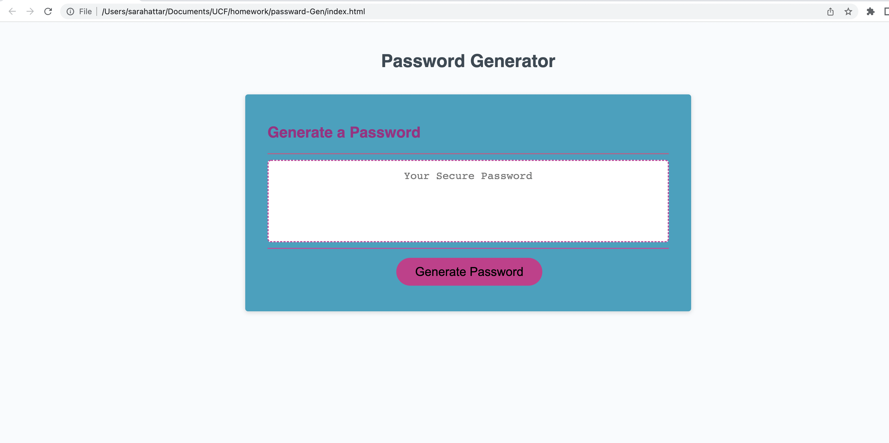

# Password Generator 

# Table of Contents 
• Description

•Navigation

•Screenshot of Site

• Links

• References
# Description

This is a application that enables employees (or any user) to generate one random password at a time based on the criteria that they’ve selected. 

This app runs in the browser and lineaments dynamically updated HTML and CSS powered by JavaScript code.

# Navigation 

A User Guide is as follows: 
When you access the home page you will have a button of which states "Generate Password" in black with a pink background.

when clicked on the user will be prompted with a series of questions.

Based on the criteria selected in that prompt the user will be generated a passward inside of the white text-box that previously stated "Your Secure Password".

 However if the user does not input the correct criteria based off of the guidelines given the text in the white text-box will present "undefined".

If the user made a mistake the user may simply just refresh the page and start the quick and easy process again.

# Screenshot of site 

# Links 

[Repo link](https://github.com/SarahAmel/passward-Gen)        

[live link](https://sarahamel.github.io/passward-Gen/)

[Linkedin Link](https://www.linkedin.com/in/sarah-attar-477312235/)

# Contact 

Email: sarahattar76@gmail.com

# References
The play back zoom videos from Unit 3 helped immensely.

The staff within the UCF bootcamp helped me tremendously. 

I am greatly appreciative of all the knowlegeable Tutors available and TA's who helped after or before class. 